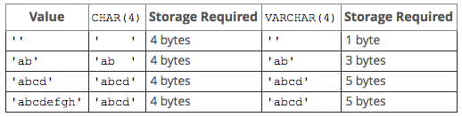

### Revisiting Data Type (2020.09.20)

---

**데이터베이스에서 사용하는 몇 가지 데이터 타입들을 추가적으로 정의하는 강의파트다**

**20일 MySQL 학습 파트 마지막 부분인데, 다행이도 자료형에 대한 재정의하는 부분이라 쉽게 넘어갔던 것 같다.**

많은 서비스들에서 요일과 관련한 계산, 특히 예약이나 일정 관리에 관련한 서비스들은 많이 다루는 부분이라 강사가 비중있게 내용을 다루는 것 같다.

- VARCHAR vs CHAR

- VARCHAR는 이미 많이 사용해서 어느정도 사용법을 인지하고 있지만, CHAR는 이 파트에서 처음 나왔고, 굳이 찾아볼 일이 없다보니 (관련 프로젝트를 해보면서 찾아볼 일이 없었다.)

- 그런데 CHAR의 경우 fixed length를 갖고 있다고 하는데, 이 부분이 `Char is faster for fixed length text`라는 점을 분명히 한다.

- 예시를 보아하니, CHAR(4)라고 선언하면 CHAR는 4bytes를 차지하는데 비해 VARCAHR의 경우 상황에따라 더 많기도, 적기도 한 용량 차이를 보인다.



- 그래도 대부분의 경우에는 VARCHAR를 사용하고, 정확하게 `fixed length`라는 점이 인지되지 않으면 CHAR를 사용하지는 않는 것 같다.

- 이유 : 분명하다. CHAR에 기록되야하는 값들은 무슨 값이 들어올지 명확하게 인지될 때만 사용한다. 성별, Yes or No 등.

- 아래의 예제를 참고하면 좋을 것 같다.

```sql

CREATE TABLE dogs (name CHAR(5), breed VARCHAR(10));

INSERT INTO dogs (name, breed) VALUES ('bob', 'beagle');

INSERT INTO dogs (name, breed) VALUES ('robby', 'corgi');

INSERT INTO dogs (name, breed) VALUES ('Princess Jane', 'Retriever');

SELECT * FROM dogs;

INSERT INTO dogs (name, breed) VALUES ('Princess Jane', 'Retrievesadfdsafdasfsafr');

SELECT * FROM dogs;

```

---

- DECIMAL이라는 형태의 자료형을 선언하는 것도 가능하다

- DECIMAL(M, D)에서

- M은 소수 부분을 포함한 실수의 총 자릿수를 나타내며, 최댓값은 65입니다.

- D는 소수 부분의 자릿수를 나타내며, D가 0이면 소수 부분을 가지지 않습니다.

```sql


CREATE TABLE items(price DECIMAL(5,2));

INSERT INTO items(price) VALUES(7);

INSERT INTO items(price) VALUES(7987654);

INSERT INTO items(price) VALUES(34.88);

INSERT INTO items(price) VALUES(298.9999);

INSERT INTO items(price) VALUES(1.9999);

SELECT * FROM items;

```

---

- Float 자료형 사용하기 (Decimal보다 큰 범위의 수를 다루는 자료형)

```sql

CREATE TABLE thingies (price FLOAT);

INSERT INTO thingies(price) VALUES (88.45);

SELECT * FROM thingies;

INSERT INTO thingies(price) VALUES (8877.45);

SELECT * FROM thingies;

INSERT INTO thingies(price) VALUES (8877665544.45);

SELECT * FROM thingies;

```

---

- DATE, TIME, and DATETIME

- DATE의 경우 `'YYYY-MM-DD'` 형태의 값을 따라간다.

- TIME의 경우 `'HH:MM:SS'` 형태의 값을 지정해줘야한다.

- DATETIME은 위의 2개 경우를 모두 적용하는 값이고, `'YYYY-MM-DD HH:MM:SS'` 가운데에 띄어쓰기가 들어간다.

```sql

CREATE TABLE people (name VARCHAR(100), birthdate DATE, birthtime TIME, birthdt DATETIME);

INSERT INTO people (name, birthdate, birthtime, birthdt)
VALUES('Padma', '1983-11-11', '10:07:35', '1983-11-11 10:07:35');

INSERT INTO people (name, birthdate, birthtime, birthdt)
VALUES('Larry', '1943-12-25', '04:10:42', '1943-12-25 04:10:42');

SELECT * FROM people;

```

---

- CURDATE(), CURTIME(), NOW() 이 세 개의 메소드는 모두 날짜, 시간과 관련한 메소드로 `현재 시간과 일자`를 표기하는 기능을 지원한다.

```sql

INSERT INTO people (name, birthdate, birthtime, birthdt) VALUES('Larry', curdate(), curtime(), now());

```

---

- DATE FORMAT 정리하기

- DAY : 년/월에서 일자 분리해서 표기하기

- DAYNAME : 월~일 중에 요일 표기

- DAYOFWEEK : 주 중 몇 번째 요일인지 표기 (일: 0, 월: 1,화: 2,수: 3,목: 4,금: 5,토: 6)

- DAYOFYEAR : 1년 중 몇 번째 요일인지 표기

- MONTH : 월 표기 (숫자)

- MONTHNAME : 월 (영문 텍스트, JAN / FEB / MAR 등)

- HOUR : 시간 표기

- MINUTE : 분 표기

- `SELECT DATE_FORMAT(birthdt, 'Was born on a %W') FROM people;` : 요일 표기

```sql

SELECT name, birthdate FROM people;

SELECT name, DAY(birthdate) FROM people;

SELECT name, birthdate, DAY(birthdate) FROM people;

SELECT name, birthdate, DAYNAME(birthdate) FROM people;

SELECT name, birthdate, DAYOFWEEK(birthdate) FROM people;

SELECT name, birthdate, DAYOFYEAR(birthdate) FROM people;

SELECT name, birthtime, DAYOFYEAR(birthtime) FROM people;

SELECT name, birthdt, DAYOFYEAR(birthdt) FROM people;

SELECT name, birthdt, MONTH(birthdt) FROM people;

SELECT name, birthdt, MONTHNAME(birthdt) FROM people;

SELECT name, birthtime, HOUR(birthtime) FROM people;

SELECT name, birthtime, MINUTE(birthtime) FROM people;

SELECT CONCAT(MONTHNAME(birthdate), ' ', DAY(birthdate), ' ', YEAR(birthdate)) FROM people;

SELECT DATE_FORMAT(birthdt, 'Was born on a %W') FROM people;

SELECT DATE_FORMAT(birthdt, '%m/%d/%Y') FROM people;

SELECT DATE_FORMAT(birthdt, '%m/%d/%Y at %h:%i') FROM people;
```

---

- Date Math

```sql

SELECT * FROM people;

SELECT DATEDIFF(NOW(), birthdate) FROM people; : 현재와 기록된 일자를 비교했을 때, 일자 수로만 (365일 기준) 얼마나 차이나는가?

SELECT name, birthdate, DATEDIFF(NOW(), birthdate) FROM people;

SELECT birthdt FROM people;

SELECT birthdt, DATE_ADD(birthdt, INTERVAL 1 MONTH) FROM people; : 기록된 시간과 일자에서 한 달 추가하기

SELECT birthdt, DATE_ADD(birthdt, INTERVAL 10 SECOND) FROM people; : 기록된 시간과 일자에서 초 추가하기

SELECT birthdt, DATE_ADD(birthdt, INTERVAL 3 QUARTER) FROM people; : 기록된 시간과 일자에서 분기 추가히기

SELECT birthdt, birthdt + INTERVAL 1 MONTH FROM people;

SELECT birthdt, birthdt - INTERVAL 5 MONTH FROM people;

SELECT birthdt, birthdt + INTERVAL 15 MONTH + INTERVAL 10 HOUR FROM people;

```

---

```sql

CREATE TABLE comments (
    content VARCHAR(100),
    created_at TIMESTAMP DEFAULT NOW()
);

INSERT INTO comments (content) VALUES('lol what a funny article');

INSERT INTO comments (content) VALUES('I found this offensive');

INSERT INTO comments (content) VALUES('Ifasfsadfsadfsad');

SELECT * FROM comments ORDER BY created_at DESC;

CREATE TABLE comments2 (
    content VARCHAR(100),
    changed_at TIMESTAMP DEFAULT NOW() ON UPDATE CURRENT_TIMESTAMP
);

INSERT INTO comments2 (content) VALUES('dasdasdasd');

INSERT INTO comments2 (content) VALUES('lololololo');

INSERT INTO comments2 (content) VALUES('I LIKE CATS AND DOGS');

UPDATE comments2 SET content='THIS IS NOT GIBBERISH' WHERE content='dasdasdasd';

SELECT * FROM comments2;

SELECT * FROM comments2 ORDER BY changed_at;

CREATE TABLE comments2 (
    content VARCHAR(100),
    changed_at TIMESTAMP DEFAULT NOW() ON UPDATE NOW()
);

```

- DATETIME과 TIMESTAMP의 차이

```
두 데이터 타입의 차이는 시간대 정보를 가지고 있느냐 있지 않느냐의 차이. 즉, DATETIME은 입력되는 날짜와 시간을 그대로 입력받는다. 하지만, TIMESTAMP는 time_zone이라는 시스템 변수로 저장된 값을 기본으로 하여 날짜와 시간정보를 입력받는다
```
